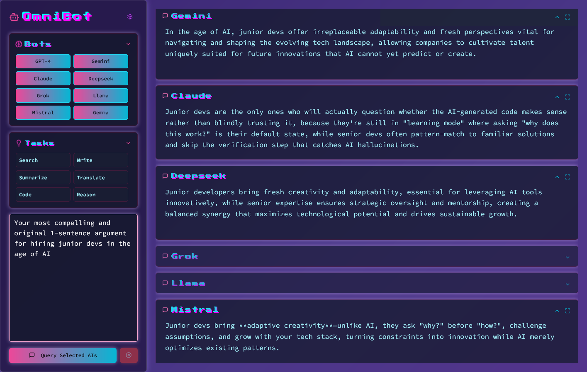

# 🚀 OmniBot (WIP)

A web app that allows users to send the same prompt to multiple AI models simultaneously and compare responses.

[](https://echoes-ai.vercel.app/)

## ✨ Features
- 🌎 **Multi-AI Search**: Query multiple AI models (GPT-4, Gemini, Claude, DeepSeek, Grok) at once.
- ⚡ **Easy Comparison**: View all responses in a structured format.
- 🛠 **Customizable Queries**: Users can select/deselect AI models per query.

## 🔧 Tech Stack
- **Frontend**: React, TailwindCSS
- **Backend**: Node.js, Express
- **AI Integration**: Uses Puter.js for model interactions (requires sign-up to use)

## 🤖 Built With AI  
This project was a one-time experiment in AI-assisted "vibe-coding" and exploring various AI development tools (not my usual workflow).
- **Claude + Perplexity** – Assisted in outlining the project, providing prompts, and generating documentation  
- **Lovable** – Streamlined front-end component generation and UI structuring  
- **GitHub Copilot** – Facilitated code integration, debugging, and cross-file implementations  
- **Antigravity** – Used for code review and refactoring 

## 📦 Installation
```bash
git clone https://github.com/your-username/multi-ai-query.git
cd multi-ai-query
npm install
```

## 🚀 Usage
1. Start the server:
   ```bash
   npm run dev
   ```
2. Open `http://localhost:3000` in your browser.
3. Ensure you have signed up for the Puter API and configured your API key.

## 🔄 Next Steps
- [ ] Refactor vibe-coded bloat and optimize component structure
- [ ] Multi-modal input (image + text)

## 🤝 Contributing
Pull requests are welcome! Open an issue for feature requests or bug reports.

## 🛡️ License
MIT License. See `LICENSE` for details.


